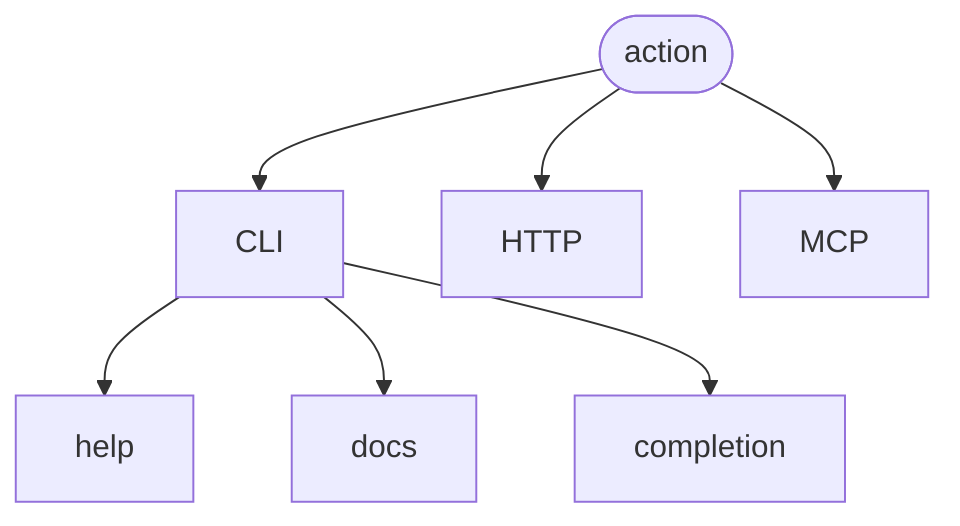
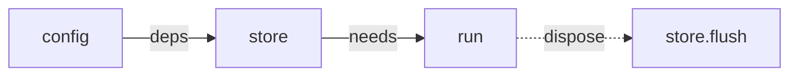

# softcli

**Declare a command once. Run it anywhere.**

## What it is

`softcli` softcli is a TypeScript command framework where commands are reusable definitions rather than CLI-only handlers. 

The same declaration can be exposed through CLI, HTTP endpoint, an MCP tool, generated documentation, shell completion, an agent-facing skill, or other adapters without redefining its inputs and behavior.

```ts
const registry = createRegistry()
  .provide("config", {
    resolve: () => loadConfig(),
  })
  .provide("store", {
    deps: ["config"],
    resolve: ({ config }) => open(config.path),
    dispose: (store) => store.flush(),
  });

registry.action({
  id: "note.list",
  summary: "List notes, newest first",

  needs: ["store"],

  input: {
    status: {
      type: "string",
      enum: ["open", "done"],
      description: "Only this status",
      cli: { short: "-s", value: "STATUS" },
    },

    limit: {
      type: "integer",
      minimum: 1,
      default: 20,
      description: "How many",
      cli: { short: "-n", value: "N" },
    },
  },

  surfaces: {
    cli:  { pattern: ["note", "list"] },
    http: { method: "GET", path: "/notes" },
    mcp: true,
  },

  run: ({ input, store }) =>
    output(store.all(input.status).slice(0, input.limit)),
});
```

There is no separate command definition for each surface.



The action remains a plain object. The different parts of `softcli` decide how to expose it.

## One schema

`input` is the canonical description of the input.

```ts
input: {
  status: {
    type: "string",
    enum: ["open", "done"],
  },
  limit: {
    type: "integer",
    minimum: 1,
    default: 20,
  },
}
```

The CLI uses it to parse and coerce arguments. HTTP uses it to validate requests. MCP publishes it as the tool's input schema. Documentation gets the same defaults, enums, descriptions, and constraints.

TypeScript derives the handler input from it too:

```ts
input.status // "open" | "done" | undefined
input.limit  // number
```

There is only one copy of the rules to keep correct.

## One action, several surfaces

From the declaration above, `softcli` can provide:

| Surface                        | Result                                       |
| ------------------------------ | -------------------------------------------- |
| `notes note list -s open -n 5` | parsed and coerced CLI input                 |
| `GET /notes?status=open`       | the same action over HTTP                    |
| `notes note list --json`       | stable machine-readable output               |
| `notes note list --quiet`      | bare output for scripts                      |
| `notes note list --help`       | generated usage, options, defaults and enums |
| `notes note <TAB>`             | shell completion                             |
| `notes docs`                   | generated Markdown reference                 |
| `notes skill`                  | agent-facing command reference               |
| `note_list`                    | MCP tool backed by the same input schema     |

Adding a surface does not mean adding another implementation.

```ts
surfaces: {
  cli:  { pattern: ["note", "list"] },
  http: { method: "GET", path: "/notes" },
  mcp: true,
}
```

If a surface is not declared, the action is not exposed there.

## Capabilities

Actions can declare what they need instead of constructing dependencies themselves.

```ts
const registry = createRegistry()
  .provide("config", {
    resolve: () => loadConfig(),
  })
  .provide("store", {
    deps: ["config"],
    resolve: ({ config }) => open(config.path),
    dispose: (store) => store.flush(),
  });
```

Then:

```ts
registry.action({
  id: "note.list",
  needs: ["store"],

  run: ({ input, store }) => {
    // store is ready here
  },
});
```



Capabilities are resolved before the handler runs and can depend on other capabilities.

This keeps actions declarative without turning the registry into a global bag of objects.

## Entry points

`softcli` is one package with focused subpath exports.

| Import                         | Purpose                                                          |
| ------------------------------ | ---------------------------------------------------------------- |
| [`softcli`](src/core)          | Actions, schemas, capabilities, registry. No terminal knowledge. |
| [`softcli/cli`](src/cli)       | argv parsing, help, completion, output contracts and exit codes  |
| [`softcli/mcp`](src/mcp)       | Expose actions as MCP tools without an MCP SDK dependency        |
| [`softcli/docs`](src/docs)     | Generate Markdown references for people and agents               |
| [`softcli/remote`](src/remote) | Materialise commands from remote manifests or OpenAPI            |

There are **zero runtime dependencies**.

Validation is optional and uses [Standard Schema](https://standardschema.dev), so libraries such as Zod, Valibot and ArkType can be used without `softcli` depending on any of them.

## Try it

```sh
npm install
npm run examples
```

### One declaration, three surfaces

```sh
node examples/dist/petshop/cli.js pet add Rex -a 3 -b corgi

# see the MCP tools an agent receives
node examples/dist/petshop/cli.js mcp tools

# expose the same actions over HTTP
node examples/dist/petshop/cli.js serve --port 8799 &

curl -X POST localhost:8799/pets \
  -d '{"name":"Ada","age":99}'
```

### A local CLI

```sh
node examples/dist/kitchen-sink/cli.js note add "Ship softcli" -t work
node examples/dist/kitchen-sink/cli.js note list

# generate the agent-facing reference
node examples/dist/kitchen-sink/cli.js skill
```

### Commands supplied by a server

```sh
node examples/dist/clerver/cli.js serve --port 8787 &

node examples/dist/clerver/cli.js pet list
node examples/dist/clerver/cli.js pet add Rex --species dog --age 3
```

### Turn an OpenAPI document into a CLI

The API does not need to know that `softcli` exists.

```sh
# any server that answers the document. clerver happens to be one
node examples/dist/clerver/cli.js serve --port 8793 &

node examples/dist/open-cli/cli.js \
  --spec examples/samples/petstore.json \
  pet list --limit 2
```

## Examples

The repository includes four working examples:

| Example                                 | Shows                                                |
| --------------------------------------- | ---------------------------------------------------- |
| [`petshop`](examples/petshop)           | One set of actions exposed through CLI, HTTP and MCP |
| [`kitchen-sink`](examples/kitchen-sink) | The local CLI feature set                            |
| [`clerver`](examples/clerver)           | Commands discovered from a remote server             |
| [`open-cli`](examples/open-cli)         | Building a CLI from an existing OpenAPI document     |

## Documentation

The full manual lives in [`docs/`](docs/) and ships with the package.

Start with:

* [`Why softcli`](docs/01-why.md)
* [`Getting started`](docs/02-getting-started.md)
* [`Actions`](docs/03-actions.md)
* [`Validation`](docs/04-validation.md)

## Why

Most CLI libraries make the command declaration part of the setup process:

```ts
program
  .command("note list")
  .option("-s, --status <status>")
  .action(handler);
```

That works well when the terminal is the only consumer.

It stops working the moment the terminal is not the only caller. A typed command, an HTTP request and an MCP tool call are the same call: the same arguments, the same defaults, the same validations. Only the way they arrive is different.

Declared per surface, that agreement is written several times and maintained several times. The day one copy drifts, an agent is shown a rule the request is never held to, and a bound enforced in the terminal is missing from the API.

The callers are no longer only people. An agent has to be told what a command accepts, as a schema, before it can call anything. The information that `.action(handler)` throws away is exactly the information the agent era needs kept.

`softcli` keeps that information alive.

```ts
const action = {
  id: "note.list",
  input: { /* ... */ },
  surfaces: { /* ... */ },
  run: handler,
};
```

The CLI is a view of that action.

So is HTTP.

So is MCP.

**The command is the data. The interfaces are adapters.**

## License

Copyright © 2026 Softov.

Licensed under the [MIT License](LICENSE).