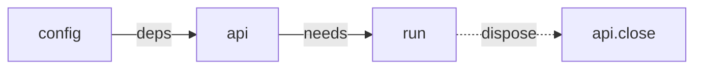

# softcli

**Declare a command once. Run it anywhere.**

[](https://www.npmjs.com/package/softcli)
[](https://www.npmjs.com/package/softcli)
[](https://www.npmjs.com/package/softcli)
[](#entry-points)
[](LICENSE)

## What it is

`softcli` is a TypeScript command framework where commands are reusable definitions rather than CLI-only handlers. 

The same declaration can be exposed through CLI, HTTP endpoint, an MCP tool, generated documentation, shell completion, an agent-facing skill, or other adapters without redefining its inputs and behavior.

```ts
const registry = createRegistry()
  .provide("config", {
    resolve: () => loadConfig(),
  })
  .provide("store", {
    deps: ["config"],
    resolve: ({ config }) => open(config.path),
    dispose: (store) => store.flush(),
  });

registry.action({
  id: "note.list",
  summary: "List notes, newest first",

  needs: ["store"],

  input: {
    status: {
      type: "string",
      enum: ["open", "done"],
      description: "Only this status",
      cli: { short: "-s", value: "STATUS" },
    },

    limit: {
      type: "integer",
      minimum: 1,
      default: 20,
      description: "How many",
      cli: { short: "-n", value: "N" },
    },
  },

  surfaces: {
    cli:  { pattern: ["note", "list"] },
    http: { method: "GET", path: "/notes" },
    mcp: true,
  },

  run: ({ input, store }) =>
    output(store.all(input.status).slice(0, input.limit)),
});

registry.action({
  id: "note.add",
  summary: "Add a note",

  needs: ["store"],

  input: {
    title: {
      type: "string",
      minLength: 1,
      maxLength: 120,
      description: "What the note says",
    },

    status: {
      type: "string",
      enum: ["open", "done"],
      default: "open",
      description: "Where it starts",
      cli: { short: "-s", value: "STATUS" },
    },
  },
  required: ["title"],

  surfaces: {
    cli:  { pattern: ["note", "add", ":title"] },
    http: { method: "POST", path: "/notes" },
    mcp: true,
  },

  run: ({ input, store }) => output(store.add(input)),
});
```

There is no separate command definition for each surface.


The action remains a plain object. The different parts of `softcli` decide how to expose it.

## One schema

`input` is the canonical description of the input, and the only statement of the rules.

```ts
title:  { type: "string",  minLength: 1, maxLength: 120 }
status: { type: "string",  enum: ["open", "done"], default: "open" }
limit:  { type: "integer", minimum: 1, default: 20 }
```

The CLI uses it to parse and coerce arguments. HTTP uses it to validate requests. MCP publishes it as the tool's input schema. Documentation gets the same defaults, enums, descriptions, and constraints.

So a rule is enforced the same way whichever road the value took:

```sh
notes note add ""                     # title must be 1 to 120 characters
curl -X POST /notes -d '{"title":""}' # 400 title must be 1 to 120 characters
note_add({ status: "later" })         # isError: status must be one of open, done
```

TypeScript derives the handler input from it too:

```ts
input.title  // string
input.status // "open" | "done"
input.limit  // number
```

There is only one copy of the rules to keep correct.

## One action, several surfaces

From the declaration above, `softcli` can provide:

| Surface                          | Result                                       |
| -------------------------------- | -------------------------------------------- |
| `notes note list -s open -n 5`   | parsed and coerced CLI input                 |
| `notes note add "Ship it"`       | the slot, the default and the length bound   |
| `GET /notes?status=open`         | the same action over HTTP                    |
| `POST /notes`                    | the same validation, answered with `400`     |
| `notes note list --json`         | stable machine-readable output               |
| `notes note list --quiet`        | bare output for scripts                      |
| `notes note add --help`          | generated usage, options, defaults and enums |
| `notes note <TAB>`               | shell completion                             |
| `notes docs`                     | generated Markdown reference                 |
| `notes skill`                    | agent-facing command reference               |
| `note_list`, `note_add`          | MCP tools backed by the same input schemas   |

Adding a surface does not mean adding another implementation.

```ts
surfaces: {
  cli:  { pattern: ["note", "add", ":title"] },
  http: { method: "POST", path: "/notes" },
  mcp: true,
}
```

If a surface is not declared, the action is not exposed there.

## Capabilities

Actions can declare what they need instead of constructing dependencies themselves.

The usual case is an authenticated client that half the program needs and nobody wants to build twice.

```ts
const registry = createRegistry()
  .provide("config", {
    resolve: () => loadConfig(),
  })
  .provide("api", {
    deps: ["config"],
    resolve: ({ config }) => createClient({
      baseUrl: config.url,
      token: config.token,
    }),
    dispose: (api) => api.close(),
  });
```

Then:

```ts
registry.action({
  id: "case.show",
  needs: ["api"],

  input: {
    id: { type: "string", minLength: 1 },
  },
  required: ["id"],

  surfaces: {
    cli: { pattern: ["case", "show", ":id"] },
    mcp: true,
  },

  run: ({ input, api }) => output(api.get(`/cases/${input.id}`)),
});
```



Capabilities are resolved before the handler runs, in dependency order, and can depend on other capabilities. Whatever they open is disposed afterwards, whether the handler returned or threw.

Nothing is constructed for an action that does not ask for it, so a command that fails on a bad argument never opens the connection.

This keeps actions declarative without turning the registry into a global bag of objects.

## Entry points

`softcli` is one package with focused subpath exports.

| Import                         | Purpose                                                          |
| ------------------------------ | ---------------------------------------------------------------- |
| [`softcli`](src/core)          | Actions, schemas, capabilities, registry. No terminal knowledge. |
| [`softcli/cli`](src/cli)       | argv parsing, help, completion, output contracts and exit codes  |
| [`softcli/mcp`](src/mcp)       | Expose actions as MCP tools without an MCP SDK dependency        |
| [`softcli/docs`](src/docs)     | Generate Markdown references for people and agents               |
| [`softcli/remote`](src/remote) | Materialise commands from remote manifests or OpenAPI            |
| [`softcli/config`](src/config) | Find the configuration file, and say which one a value came from |

There are **zero runtime dependencies**.

Validation is optional and uses [Standard Schema](https://standardschema.dev), so libraries such as Zod, Valibot and ArkType can be used without `softcli` depending on any of them.

## Try it

```sh
npm install
npm run examples
```

### One declaration, three surfaces

```sh
node examples/dist/petshop/cli.js pet add Rex -a 3 -b corgi

# see the MCP tools an agent receives
node examples/dist/petshop/cli.js mcp tools

# expose the same actions over HTTP
node examples/dist/petshop/cli.js serve --port 8799 &

curl -X POST localhost:8799/pets \
  -d '{"name":"Ada","age":99}'
```

### A local CLI

```sh
node examples/dist/kitchen-sink/cli.js note add "Ship softcli" -t work
node examples/dist/kitchen-sink/cli.js note list

# generate the agent-facing reference
node examples/dist/kitchen-sink/cli.js skill
```

### Commands supplied by a server

```sh
node examples/dist/clerver/cli.js serve --port 8787 &

node examples/dist/clerver/cli.js pet list
node examples/dist/clerver/cli.js pet add Rex --species dog --age 3
```

### Turn an OpenAPI document into a CLI

The API does not need to know that `softcli` exists.

```sh
# any server that answers the document. clerver happens to be one
node examples/dist/clerver/cli.js serve --port 8793 &

node examples/dist/open-cli/cli.js \
  --spec examples/samples/petstore.json \
  pet list --limit 2
```

### A CLI defined in a YAML file

Nobody writes a handler. The document states the schemas, the surfaces and the steps.

```sh
# the pet commands in the document call this
node examples/dist/petshop/cli.js serve --port 8799 &

node examples/dist/s2cli/cli.js --document examples/samples/depot.yaml pet list
node examples/dist/s2cli/cli.js --document examples/samples/depot.yaml release deploy -e staging --force

# the same file, as MCP tools and as an HTTP API of its own
node examples/dist/s2cli/cli.js --document examples/samples/depot.yaml mcp tools
node examples/dist/s2cli/cli.js --document examples/samples/depot.yaml serve --port 8801 &

curl -X POST localhost:8801/pets -d '{"name":"Ada","age":99}'
```

## Examples

The repository includes five working examples:

| Example                                 | Shows                                                |
| --------------------------------------- | ---------------------------------------------------- |
| [`petshop`](examples/petshop)           | One set of actions exposed through CLI, HTTP and MCP |
| [`kitchen-sink`](examples/kitchen-sink) | The local CLI feature set                            |
| [`clerver`](examples/clerver)           | Commands discovered from a remote server             |
| [`open-cli`](examples/open-cli)         | Building a CLI from an existing OpenAPI document     |
| [`s2cli`](examples/s2cli)               | Commands declared in a YAML or JSON document         |

## Commands from a document

Commands already arrive here from two documents this library did not write: a remote manifest and an OpenAPI specification. A YAML or JSON file is the same seam a third time, and it is the one that turns "commands are data" from a claim into a demonstrated property.

```text
document -> ActionDefinition -> registry -> CLI / HTTP / MCP
```

[`examples/s2cli`](examples/s2cli) is that front end. The author of the document gets validation, help, completion, `--json`, a generated reference, HTTP routes and MCP tools without implementing any of those surfaces, and without writing a handler.

Everything a document-defined command needs already exists except one thing. `run` is a function, and a file cannot hold one, so execution is stated as data: named executors and an ordered list of steps.

```yaml
commands:
  release.deploy:
    summary: Deploy the application

    input:
      env:   { type: string, enum: [staging, production], default: production, cli: { short: -e } }
      force: { type: boolean, default: false, cli: { short: -f } }

    surfaces:
      cli: { pattern: [release, deploy] }

    run:
      - exec:
          command: ./scripts/build.sh
          args: ["{env}"]

      - exec:
          command: ./scripts/deploy.sh
          args:
            - "{env}"
            - { when: force, value: "--force" }

      - rest:
          method: POST
          endpoint: "{$config.hooks.deployed}"
```

`input` is the same map of JSON Schema `registry.action` takes, and `surfaces` is the same declaration, so the terminal, an HTTP request and an MCP tool call are held to one rule exactly as they are in code.

| executor   | what it does                                            |
| ---------- | ------------------------------------------------------- |
| `noop`     | nothing: the word that only exists to hold subcommands  |
| `internal` | another command of the same registry, through `execute` |
| `exec`     | one process, given its arguments as argv                |
| `rest`     | one HTTP call, over the transport remote commands use   |

Steps run in order and stop at the first failure. A single step may be written unwrapped, and a bare name is a step with nothing to configure (`run: noop`). An executor the program does not have is a registration error, so it is a crash on the first run of the binary rather than a surprise on the one command nobody tested. So is a placeholder naming no field, an `internal` step calling a command the document does not declare, and two of them calling each other.

**Arguments are arrays, never a shell string.** Interpolating a value into a shell string is command injection the moment that value comes from anywhere but the author's own keyboard, and here it comes from whoever typed the command. `args` is a list and reaches the process as one, so `;` and `$(...)` in a value arrive as literal text. `shell: true` is how to ask for the other behaviour, and asking is the point.

**No template language.** `{{#if force}}--force{{/if}}` means a dependency and an argument list that gets re-parsed. The input is already validated and typed, so the two things a template is used for are data instead: `{ when: force, value: "--force" }` drops a value, `{ each: tags, value: "--tag={$item}" }` repeats one. Interpolation is one rule with no exception: `$` means "not an input field". Everything without it is the input, all the way down, so `{env}` is the field a deploy command always has and `{theme.mode}` reaches into a structured one. `{$env.NAME}` is the environment, `{$config.theme.mode}` is the configuration that [`softcli/config`](src/config) resolved, and `{$item}` is the value of the surrounding `each`.

**A shell step does not become an agent tool by accident.** If MCP came for free, a YAML file would be a set of tools an agent can call and `exec` is arbitrary shell. `surfaces.mcp` being off by default already prevents the worst of it; this front end goes further and refuses to publish a command holding an `exec` step as an MCP tool or an HTTP route unless that command says so:

```yaml
    allowRemoteExec: true
```

Separate from `surfaces`, refused loudly rather than dropped quietly, and it travels: a command whose only step calls another command that runs a process is a command that runs a process. `rest` and `internal` steps default the normal way.

**`imports:` and `env:`.** A document may compose others and load environment files, both taking a bare path or `{ path: ..., optional: true }` for a file that may not be there. Later wins, and the importing document wins over everything it imported.

**YAML, without a dependency.** `softcli` has none and a command document is not worth one, so [`yaml.ts`](examples/s2cli/yaml.ts) reads the subset a document is written in and *refuses* the rest by name - anchors, aliases, tags, block scalars, merge keys, multiple documents. A hand-written YAML parser is a liability exactly to the extent that it accepts a document and reads it differently from a real one, and refusing is how that is bounded. Nothing downstream reads YAML: the reader takes parsed data, so a full parser is a one-line substitution for anybody who wants one.

## Documentation

The full manual lives in [`docs/`](docs/) and ships with the package.

Start with:

* [`Getting started`](docs/01-getting-started.md)
* [`Actions`](docs/02-actions.md)
* [`Validation`](docs/03-validation.md)

What is not built yet, and the questions still open, are in [`ROADMAP.md`](ROADMAP.md).

## Why

Not because parsing is hard. Parsing is the solved part.

Take any program that has been maintained for a year and count the lines that are *about* its commands against the lines that are about being a program at all:

* loading a config file, and a profile or target within it
* credentials, and never printing them in an error
* `--json` that stays stable, `--quiet` that prints one identifier
* exit codes a script can switch on
* reading stdin when something is piped in
* `NO_COLOR`, TTY detection, terminal width
* completion that knows this installation's ids, not just the flag names
* a reference document that is still true
* and now MCP tools, for the agent that will drive it

A parser gives you the first third of the first line. Everything after that, every program writes again.

Most CLI libraries also make the command declaration part of the setup process:

```ts
program
  .command("note list")
  .option("-s, --status <status>")
  .action(handler);
```

The description is a string handed to a builder and the behaviour is a closure. After that call returns there is nothing left to *ask*: no object that knows the command exists, what it takes, what it means, or what it needs. So help drifts, because a usage line is a comment and comments rot. Cross-cutting behaviour has nowhere to live, so `--json` is written again per action and one of them prints a stray `console.log`. And nothing can be checked, because there is no registry to check against.

That works well when the terminal is the only consumer.

It stops working the moment the terminal is not the only caller. A typed command, an HTTP request and an MCP tool call are the same call: the same arguments, the same defaults, the same validations. Only the way they arrive is different.

Declared per surface, that agreement is written several times and maintained several times. The day one copy drifts, an agent is shown a rule the request is never held to, and a bound enforced in the terminal is missing from the API.

The callers are no longer only people. An agent has to be told what a command accepts, as a schema, before it can call anything. The information that `.action(handler)` throws away is exactly the information the agent era needs kept.

`softcli` keeps that information alive.

```ts
const action = {
  id: "note.list",
  input: { /* ... */ },
  surfaces: { /* ... */ },
  run: handler,
};
```

The CLI is a view of that action.

So is HTTP.

So is MCP.

The cost is one constraint on handlers: a handler receives a canonical input object and returns a value, rather than reading `process.argv` and printing. That is the whole discipline, and everything else follows from it, because a handler that never touches the terminal can be run by something that is not a terminal.

[`softcli/mcp`](src/mcp) is the test of that. A complete MCP surface, JSON Schema generation included, in 155 lines with no dependencies. It is that small because it had nothing to invent: the actions already knew.

**The command is the data. The interfaces are adapters.**

## License

Copyright © 2026 Softov.

Licensed under the [MIT License](LICENSE).